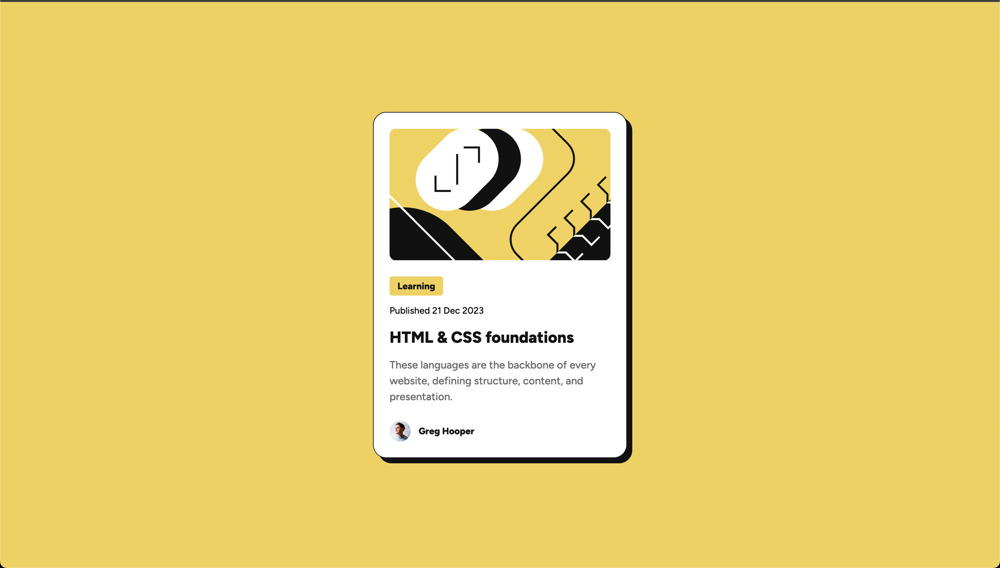

# Frontend Mentor - Blog preview card solution

This is a solution to the [Blog preview card challenge on Frontend Mentor](https://www.frontendmentor.io/challenges/blog-preview-card-ckPaj01IcS).

## Table of contents

- [Overview](#overview)
  - [The challenge](#the-challenge)
  - [Screenshot](#screenshot)
  - [Links](#links)
- [My process](#my-process)
  - [Built with](#built-with)
  - [What I learned](#what-i-learned)
  - [Continued development](#continued-development)
  - [Useful resources](#useful-resources)
- [Author](#author)

## Overview

### The challenge

Users should be able to:

- See hover and focus states for all interactive elements on the page

### Screenshot



### Links

- Solution URL: [Add solution URL here](https://your-solution-url.com)
- Live Site URL: [Add live site URL here](https://your-live-site-url.com)

## My process

### Built with

- HTML5
- CSS
- Mobile-first workflow
- Media Queries
- Flexbox

### What I learned

In this project, I learned about responsive design using media queries. This was my first experience creating a design that adapts to different screen sizes.

Here's an example of how I implemented responsive design:

```css
/* Mobile design (default) */
.card {
    width: 32.7rem;
}

/* Desktop design */
@media (min-width: 1024px) {
    .card {
        width: 38.4rem;
    }
    
    .card__title {
        font-size: 2.4rem;
    }
    
    .card__text {
        font-size: 1.6rem;
    }
}
```

I learned how to:
- Set breakpoints for different screen sizes
- Adjust element sizes for desktop views
- Make text more readable on larger screens
- Create a responsive card component

### Continued development

I want to continue improving my design skills by focusing on:

- **Responsive Design**: Practice more with different breakpoints and screen sizes
- **Media Queries**: Learn advanced techniques for responsive layouts
- **CSS Best Practices**: Improve my understanding of CSS organization
- **Mobile-First Approach**: Perfect the mobile-first development workflow

### Useful resources

- [CSS-Tricks Guide to Flexbox](https://css-tricks.com/snippets/css/a-guide-to-flexbox/)
- [MDN CSS Custom Properties](https://developer.mozilla.org/en-US/docs/Web/CSS/Using_CSS_custom_properties)

## Author

- Frontend Mentor - [@jorgeLRM](https://www.frontendmentor.io/profile/jorgeLRM)
- X - [@JorgeLrm99](https://x.com/JorgeLrm99)
